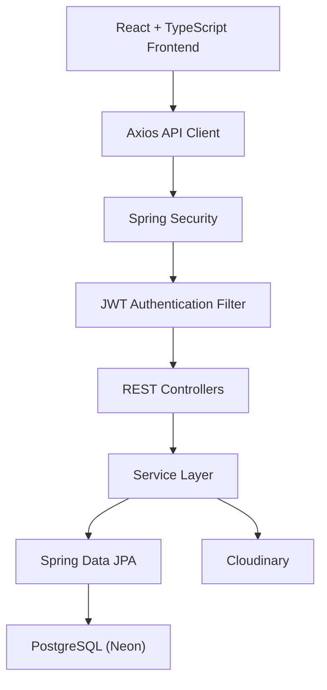
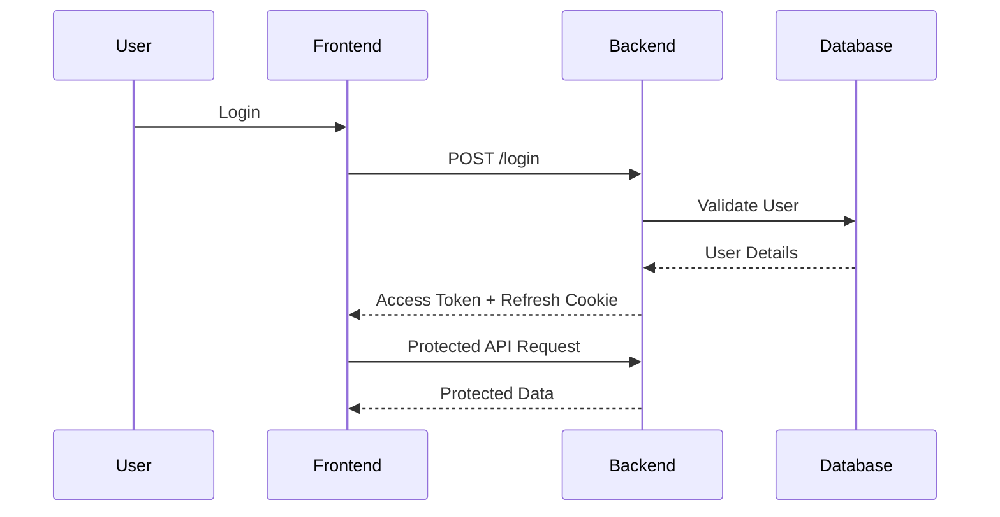
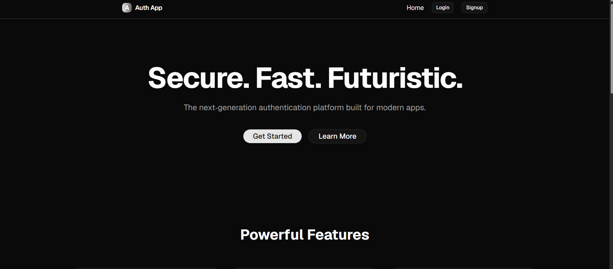
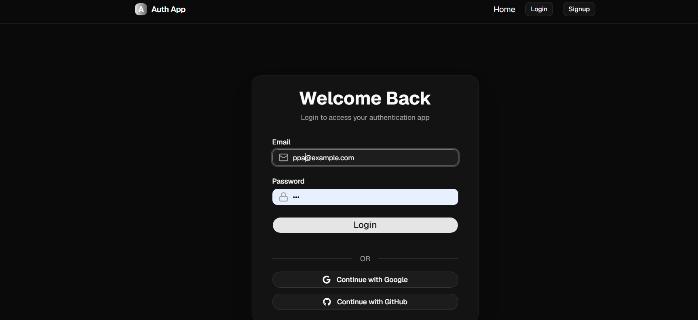
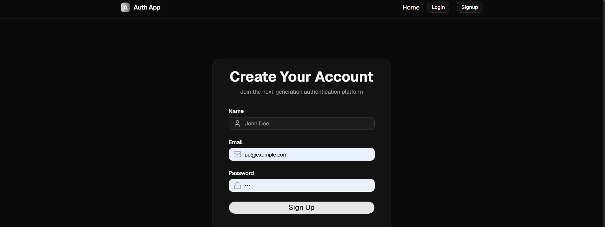
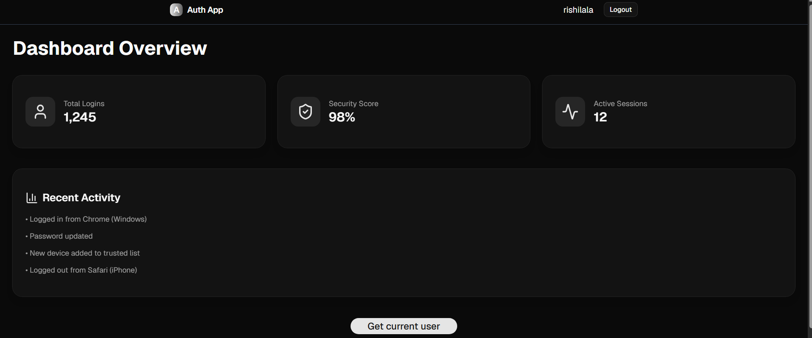
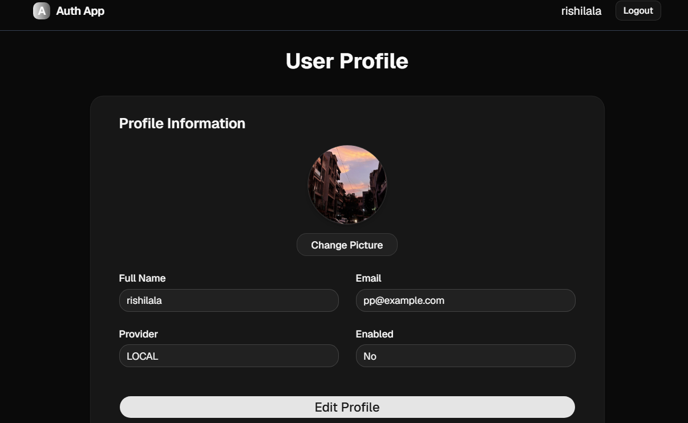
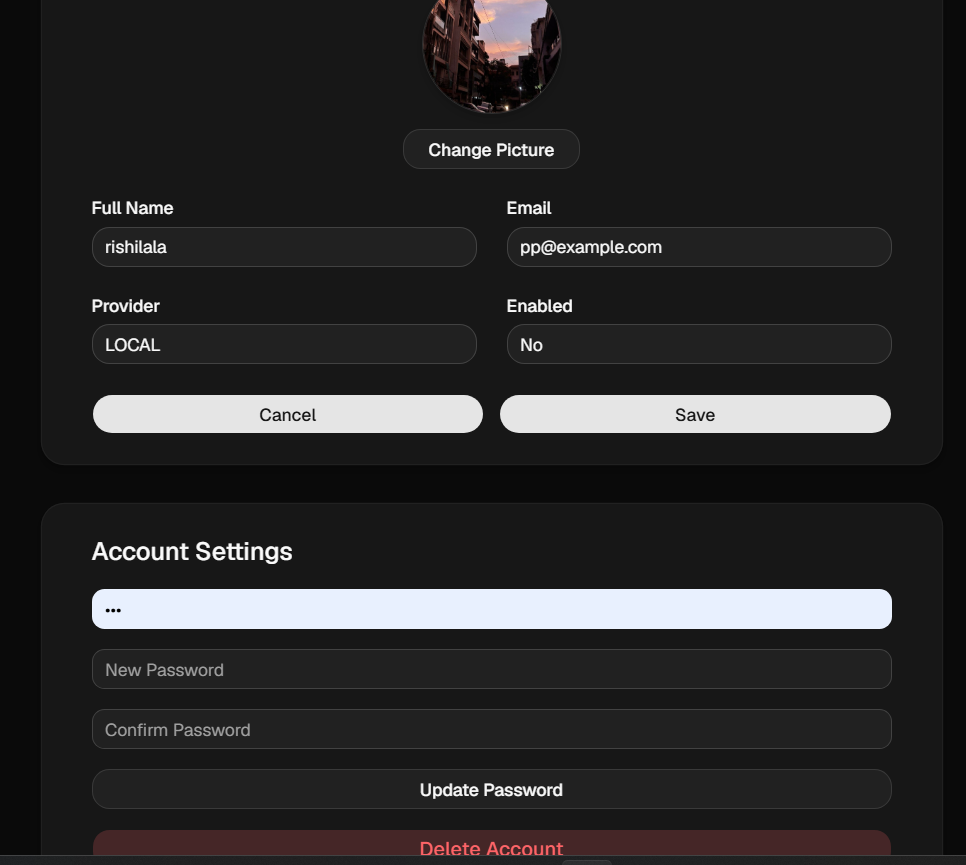
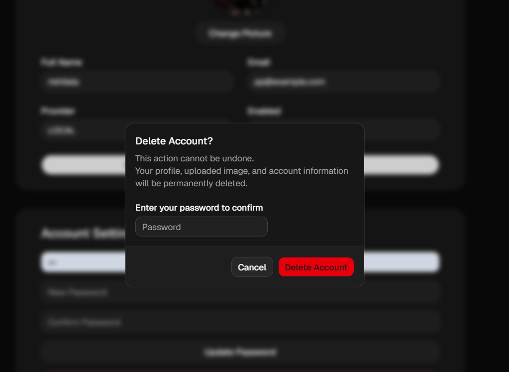
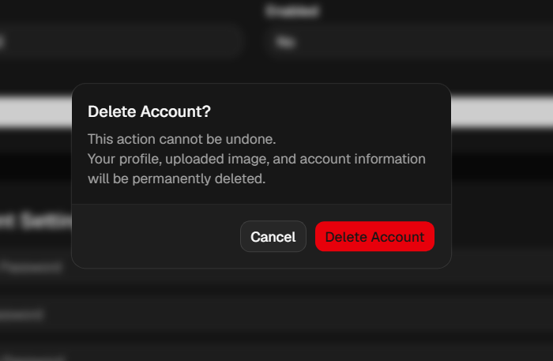

┌──────────────────────────────────────────────┐
│                                              │
│               🌍 GlobalAuth                  │
│                                              │
│ Enterprise Authentication Platform           │
│                                              │
│ Spring Boot • React • JWT • OAuth2           │
│                                              │
└──────────────────────────────────────────────┘


# 🌍 GlobalAuth


> A production-ready full-stack Authentication & Authorization platform built with **Spring Boot**, **React**, **TypeScript**, **Spring Security**, **JWT**, **OAuth2**, **PostgreSQL**, and **Cloudinary**.

GlobalAuth is a modern authentication system that provides secure user management with email/password authentication, Google and GitHub OAuth, JWT-based authorization, refresh token authentication, profile management, password updates, profile image uploads, and account deletion.

The application follows industry-standard authentication practices using **Spring Security**, **JWT access tokens**, **Refresh Tokens stored in HttpOnly Cookies**, and a clean separation between frontend and backend services.

---

## 🚀 Live Demo

### Frontend

> https://global-authapp.vercel.app

### Backend API

> https://globalauthbackend.onrender.com

---

## ✨ Features

### 🔐 Authentication

* User Registration
* Email & Password Login
* Secure Logout
* JWT Access Token Authentication
* Refresh Token Authentication
* HttpOnly Secure Cookies

### 🌐 OAuth Login

* Google OAuth 2.0
* GitHub OAuth 2.0
* Automatic account creation for first-time OAuth users

### 👤 User Management

* View Profile
* Edit Profile Information
* Upload Profile Picture
* Cloudinary Image Storage
* Change Password
* Delete Account

### 🛡 Security

* Spring Security
* BCrypt Password Encryption
* Role-Based Authorization
* Protected REST APIs
* Global Exception Handling

### ☁ Cloud Integration

* Cloudinary Image Upload
* PostgreSQL (Neon)
* Render Deployment
* Vercel Deployment

---

## 🛠 Tech Stack

### Backend

* Java 21
* Spring Boot
* Spring Security
* Spring Data JPA
* Hibernate
* JWT
* OAuth2 Client
* PostgreSQL
* Maven

### Frontend

* React
* TypeScript
* Vite
* Tailwind CSS
* shadcn/ui
* Zustand
* Axios
* React Hot Toast
* Framer Motion

### Cloud & Deployment

* Render
* Vercel
* Neon PostgreSQL
* Cloudinary

---

# 🏗 Project Structure

```text
GlobalAuth
│
├── Auth-app-frontend
│   ├── src
│   ├── public
│   ├── package.json
│   └── vite.config.ts
│
├── Auth-app-backend
│   ├── src
│   ├── pom.xml
│   ├── Dockerfile
│   └── ...
│
└── README.md
```

---

# 🏛 System Architecture



---

# 🔐 Authentication Flow


## 📸 Application Screenshots

### 🏠 Home Page
Modern Landing Page



---

### 🔑 Login
Secure User Login



---

### 📝 Sign Up
User Registration



---

### 📊 Dashboard
User Dashboard



---

### 👤 User Profile
Profile Management



---

### 🖼️ Update Profile Picture
Profile Picture Upload



---

### 🗑️ Delete Account (Local User)
Password Verification

Users registered with email/password must confirm their password before deleting their account.



---

### 🌐 Delete Account (OAuth User)
OAuth Account Deletion

Users authenticated with Google or GitHub can securely delete their account without entering a password.




```
## 📡 REST API Endpoints

### Authentication APIs

| Method | Endpoint                | Description                  |
| ------ | ----------------------- | ---------------------------- |
| POST   | `/api/v1/auth/register` | Register a new user          |
| POST   | `/api/v1/auth/login`    | Login using email & password |
| POST   | `/api/v1/auth/refresh`  | Generate a new access token  |
| POST   | `/api/v1/auth/logout`   | Logout user                  |

### User APIs

| Method | Endpoint                             | Description          |
| ------ | ------------------------------------ | -------------------- |
| GET    | `/api/v1/users/{id}`                 | Get user details     |
| PUT    | `/api/v1/users/{id}`                 | Update profile       |
| POST   | `/api/v1/users/{id}/image`           | Upload profile image |
| POST   | `/api/v1/users/{id}/change-password` | Change password      |
| DELETE | `/api/v1/users/{id}/delete-account`  | Delete account       |

---

## ⚙️ Installation

### Clone Repository

```bash
git clone https://github.com/divyansh1727/GlobalAuth.git
cd GlobalAuth
```

### Frontend

```bash
cd Auth-app-frontend
npm install
npm run dev
```

### Backend

```bash
cd Auth-app-backend
./mvnw spring-boot:run
```

---

## 🔑 Environment Variables

### Backend

```env
SPRING_DATASOURCE_URL=
SPRING_DATASOURCE_USERNAME=
SPRING_DATASOURCE_PASSWORD=

JWT_SECRET=

GOOGLE_CLIENT_ID=
GOOGLE_CLIENT_SECRET=

GITHUB_CLIENT_ID=
GITHUB_CLIENT_SECRET=

CLOUDINARY_CLOUD_NAME=
CLOUDINARY_API_KEY=
CLOUDINARY_API_SECRET=
```

### Frontend

```env
VITE_API_BASE_URL=
```

---

## 🚀 Future Improvements

* Email Verification
* Forgot Password
* Two-Factor Authentication (2FA)
* Admin Dashboard
* Audit Logging
* Docker Compose Support
* CI/CD Pipeline
* Unit & Integration Tests

---

## 👨‍💻 Author

**Divyansh Singh**

If you found this project helpful, consider giving it a ⭐ on GitHub.

